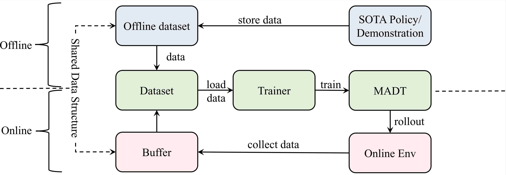

# MADT: Offline Pre-trained Multi-Agent Decision Transformer

A link to our paper can be found on [openreview](https://openreview.net/forum?id=W08IqLMlMer).

## Overview

Official codebase for Offline Pre-trained Multi-Agent Decision Transformer.
Contains scripts to reproduce experiments.

## Instructions

We provide code in two sub-directories: `atari` containing code for Atari experiments and `gym` containing code for OpenAI Gym experiments.
See corresponding READMEs in each folder for instructions; scripts should be run from the respective directories.
It may be necessary to add the respective directories to your PYTHONPATH.

## Citation

Please cite our paper as:

Note: this is not an official Google or Facebook product.
